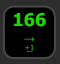
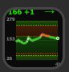

# 🩸 Nightscout Display for Stream Deck

[](https://github.com/yourusername/nightscout-display/releases/latest)
[](LICENSE)

A beautiful and feature-rich Elgato Stream Deck plugin that displays live blood glucose data from [Nightscout](https://github.com/nightscout/cgm-remote-monitor) with stunning visualizations and real-time updates.

| Number Display | Graph Display |
|:--------------:|:-------------:|
|  |  |

## ✨ Features

### 📊 Dual Display Modes
- **Number View**: Large, color-coded glucose reading with prominent trend arrow and delta
- **Graph View**: Professional glucose trend visualization with configurable time ranges (4-48 hours)

### 🎮 Interactive Controls
- **Click**: Toggle between Number and Graph display modes
- **Long Press (500ms+)**: Force immediate refresh from Nightscout API

### 🎨 Beautiful Visualizations
- **Trend Arrows**: Unicode arrows (⇈ ↑ ↗ → ↘ ↓ ⇊) show glucose direction at a glance
- **Color-Coded Zones**: Gradient backgrounds for urgent, high/low, and in-range
- **Y-Axis Labels**: Min, mid, and max values for easy reading
- **Threshold Lines**: Color-coded dashed lines for your targets
- **Glowing Effects**: Current reading highlighted with glow and shadow
- **Time Indicators**: Shows time since last reading and graph time range

### ⚡ Smart & Fast
- **Rapid Updates**: Checks every 30 seconds for new data
- **Intelligent Scheduling**: Predicts next CGM reading time
- **Configurable Time Ranges**: 4, 6, 8, 12, 24, or 48-hour graphs
- **Low Latency**: Responds within seconds to glucose changes

### 🌍 Full Nightscout Support
- Works with any Nightscout instance (Heroku, Railway, self-hosted)
- Supports both **mg/dL** and **mmol/L** units
- Optional API token authentication for private sites
- Fully customizable thresholds and colors

## 📥 Installation

### Quick Install
1. **Download** the latest `.streamDeckPlugin` file from the [Releases page](https://github.com/MrCodeEU/nightscout-display/releases/latest)
2. **Double-click** the downloaded file
3. Stream Deck software will automatically install the plugin
4. **Drag** the "Nightscout Display" action from the actions list to any key

### Manual Build (Developers)
```bash
git clone https://github.com/MrCodeEU/nightscout-display.git
cd nightscout-display
npm install
npm run build
streamdeck link com.mrcodeeu.nightscout-display.sdPlugin
```

## ⚙️ Configuration

### Step 1: Add Your Nightscout URL
1. Drag the action to a Stream Deck key
2. Click the key to open settings
3. Enter your **Nightscout URL** (e.g., `https://yoursite.herokuapp.com`)
4. If your site is private, enter your **API Token** (API secret)

### Step 2: Customize Your Settings

| Setting | Description | Default |
|---------|-------------|---------|
| **Unit** | mg/dL or mmol/L | mg/dL |
| **Graph Time Range** | 4, 6, 8, 12, 24, or 48 hours | 8 hours |
| **Normal High** | Upper normal threshold | 180 mg/dL |
| **Normal Low** | Lower normal threshold | 70 mg/dL |
| **Urgent High** | Upper urgent threshold | 250 mg/dL |
| **Urgent Low** | Lower urgent threshold | 55 mg/dL |
| **In-Range Color** | Color for normal readings | Green |
| **High/Low Color** | Color for high/low readings | Yellow |
| **Urgent Color** | Color for urgent readings | Red |

### Step 3: Start Using!
- **Click** to toggle between number and graph views
- **Long press** to force refresh
- Data updates automatically every 30 seconds

## 🔧 Troubleshooting

### ❌ No Data Displayed
**Causes:**
- Incorrect Nightscout URL
- Private site without API token
- Network connectivity issues

**Solutions:**
1. Verify URL includes `https://` and is correct
2. Add API token if site is private
3. Test URL in browser to confirm accessibility
4. Check for red triangle alert on key

### 🕐 Outdated Readings
**Causes:**
- CGM not uploading
- Nightscout site delayed
- Network issues

**Solutions:**
1. **Long press** the key to force refresh
2. Check Nightscout site directly in browser
3. Verify CGM/uploader is working
4. Check internet connection

### 🔒 Authentication Issues
**Common mistakes:**
- Using API key instead of API secret
- Incorrect token format
- Expired or changed token

**Solutions:**
1. Use your **API SECRET** (not API key)
2. Copy token carefully (no extra spaces)
3. Regenerate token in Nightscout if needed
4. Try without token first (if site is public)

### 📊 Graph Not Showing
**Possible issues:**
- No historical data available
- Insufficient readings in time range

**Solutions:**
1. Wait for more CGM readings to accumulate
2. Try shorter time range (4-6 hours)
3. Check if entries exist in Nightscout

### Manual Build (if needed):
```bash
npm run build
streamdeck pack com.mrcodeeu.nightscout-display.sdPlugin
```
This creates `com.mrcodeeu.nightscout-display.streamDeckPlugin` ready for distribution.

## 💻 Development

### Prerequisites
- Node.js 20+
- npm
- Stream Deck software
- Elgato CLI (`npm install -g @elgato/cli`)

### Quick Start
```bash
# Clone and install
git clone https://github.com/MrCodeEU/nightscout-display.git
cd nightscout-display
npm install

# Build once
npm run build

# Or watch mode (auto-rebuild + restart)
npm run watch
```

### Project Structure
```
nightscout-display/
├── .github/
│   └── workflows/
│       └── release.yml          # Auto-build on release
├── src/
│   ├── actions/
│   │   └── nightscout.ts       # Main plugin logic
│   └── plugin.ts               # Entry point
├── com.mrcodeeu.nightscout-display.sdPlugin/
│   ├── manifest.json           # Plugin metadata
│   ├── bin/
│   │   └── plugin.js          # Compiled code
│   ├── ui/
│   │   ├── nightscout.html    # Settings UI
│   │   └── sdpi.css           # Styling
│   └── imgs/                   # Icons
├── package.json
├── rollup.config.mjs          # Build config
└── tsconfig.json              # TypeScript config
```

## 🛠️ Technical Details

### API Usage
- **Current Data**: `/api/v2/properties/bgnow,buckets,delta,direction`
- **Historical Data**: `/api/v1/entries.json?count=[calculated]`
- **Update Interval**: 30 seconds (smart scheduling based on CGM frequency)

### Data Calculations
- **Graph Entries**: `(hours × 60 minutes) / 5 min per reading`
- **Examples**: 8h = 96 readings, 24h = 288 readings

### Security
- ✅ API tokens hashed with SHA-1 (Nightscout standard)
- ✅ Direct communication (no third-party servers)
- ✅ No data storage or logging of glucose values
- ✅ Secure HTTPS connections only

### Performance
- **Rendering**: SVG-based (crisp at any resolution)
- **Memory**: Lightweight (~10MB)
- **CPU**: Minimal impact
- **Network**: ~1KB per update

## 📄 License

MIT License - See [LICENSE](LICENSE) file for details.

## 🙏 Credits & Acknowledgments

**Special thanks to [@gabe565](https://github.com/gabe565) for the original [streamdeck-nightscout](https://github.com/gabe565/streamdeck-nightscout) plugin!** 🎉

This project was inspired by and builds upon Gabe's excellent work. The original plugin provided the foundation and idea for creating my own with a graph view.

**This Enhanced Version Adds:**
✨ Graph visualization with gradients and glow effects  
✨ Trend arrows (⇈ ↑ ↗ → ↘ ↓ ⇊)  
✨ Configurable time ranges (4-48h)  
✨ 30-second refresh rate  
✨ Interactive mode switching (click to toggle)  
✨ Long press force refresh  
✨ Y-axis labels and grid lines  
✨ Professional UI with instructions  
✨ Modern TypeScript codebase  
✨ Enhanced error handling  

## ⚠️ Disclaimer

This plugin is an independent project and is **not affiliated with, endorsed by, or connected to** Nightscout, Dexcom, Abbott, Medtronic, or Elgato.

**Medical Disclaimer:** This plugin is for informational purposes only. Always confirm glucose readings with your CGM device or glucose meter before making treatment decisions. Do not use this plugin as your primary glucose monitoring tool.

## ❤️ Support

If you find this plugin helpful:
- ⭐ Star the repository
- 🐛 Report bugs via [Issues](https://github.com/MrCodeEU/nightscout-display/issues)
- 💡 Suggest features
- 🤝 Contribute code

---

Made with ❤️ for the diabetes community. | > Λ V
